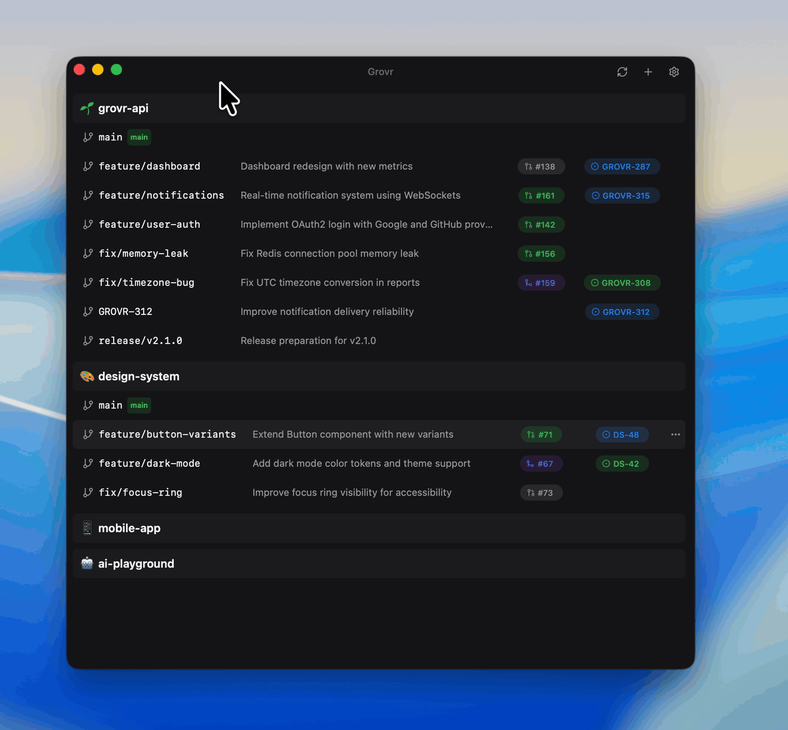

<p align="center">
  
</p>

<h1 align="center">Grovr</h1>

<p align="center">
  A native Git worktree manager for macOS
</p>

---

Git worktrees let you work on multiple branches simultaneously without stashing or context switching. Grovr makes managing them effortless with a native macOS interface.

<p align="center">
  
</p>

---

## Features

### One-Click IDE Launch

Click any worktree to open it in your preferred editor. Supports VS Code, Cursor, Zed, JetBrains IDEs, and custom commands.

<p align="center">
  
</p>

### Search & Keyboard Navigation

Type to search, use arrow keys to navigate, press Enter to launch. No mouse required.

<p align="center">
  
</p>

### Smart Worktree Creation

Create worktrees from clipboard with automatic branch name extraction. Paste a Jira issue key, GitHub PR URL, or any text matching your custom regex pattern. Also supports `grovr://` deep links for automation.

<p align="center">
  
</p>

### PR & Jira Status at a Glance

See pull request status (draft, review requested, approved, CI status) and Jira issue state directly in the worktree list. No more tab switching.

### Quick Cleanup

Delete worktrees with one click. Optionally delete the local branch too—no more orphaned branches cluttering your repo.

---

## Installation

**Download** the latest `.dmg` from [Releases](https://github.com/j1king/grovr-desktop/releases).

**Requirements:** macOS 10.15+ and Git installed.

---

## Development

```bash
# Clone and install
git clone https://github.com/j1king/grovr-desktop.git
cd grovr-desktop
pnpm install

# Run dev server
pnpm tauri dev

# Build for production
pnpm tauri build
```

See [CONTRIBUTING.md](CONTRIBUTING.md) for detailed development guide.

## Tech Stack

| Layer | Technology |
|-------|------------|
| Backend | Rust, Tauri v2, git2, tokio |
| Frontend | React 19, TypeScript, Vite |
| Styling | TailwindCSS, Radix UI |
| Testing | Playwright |

## License

MIT License - see [LICENSE](LICENSE) for details.

## Acknowledgments

Built with [Tauri](https://tauri.app/), [git2](https://github.com/rust-lang/git2-rs), and [Radix UI](https://www.radix-ui.com/).
